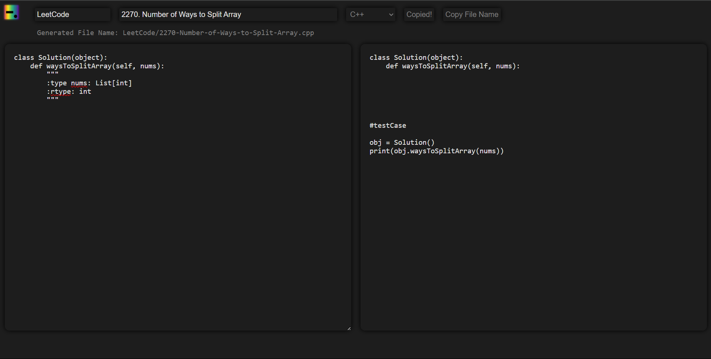

# Coedit | <a href="https://multiverseweb.github.io/Coedit/">Tool</a>

### Table of Contents

| [About Coedit](#about) | [Key Features](#key-features) | [Preview](#preview) | [Benefits](#benefits) | [Use Coedit](#use-coedit) |
|:--:|:--:|:--:|:--:|:--:|

## About
CodeIt is a software solution tool designed to streamline and enhance the coding experience for developers. It addresses several common challenges faced when working with coding platforms, such as LeetCode, and offers a range of features to improve code management, security, and performance analysis.

## Key Features

- Code Conversion and Integration:
> Efficient Code Conversion: Transforms default code templates provided by coding platforms into fully functional code. Developers can quickly adapt boilerplate code into their projects, allowing them to concentrate on algorithm development and testing.

- Code Obfuscation:
> Robust Security: Provides code obfuscation to safeguard against unauthorized access and reverse engineering. Ideal for developers needing to protect their intellectual property or work in secure environments.

- File Naming with Extensions:
> Organized File Management: Automates file naming and extension assignment, ensuring proper file organization and reducing errors in project management.
> 
>  `directoryName/questionNumber-question-title.extention`

- Time Complexity Analyzer:
> Performance Evaluation: Analyzes the time complexity of algorithms to help developers optimize performance and make informed decisions about algorithmic efficiency.

- Test Case Management:
> Seamless Testing: Simplifies the creation and execution of test cases, integrating them into the development workflow to ensure code correctness and compliance with requirements.

- User-Friendly Interface
> With a clean and straightforward UI, Coedit ensures even beginners can navigate and utilize the tool effectively.

- Multi-Language Support
> Whether you’re coding in Python, Java, C++, or any other popular programming language, Coedit has got you covered.
  
  Supported Features:
  | Language | Code Refinement | Code Obfuscation | Time Completixty Analyser | Nomenclature |
  |-|-|-|-|-|
  | Python |✔|✔|✔|✔|
  | C++ |✔|✘|✔|✔|
  | Java |✔|✘|✔|✔|
  | JavaScript |✔|✔|✘|✔|
  | C |✔|✘|✔|✔|
  | SQL |-|✔|-|✔|

>[!NOTE]
> As of now, This tool generates code according to [LeetCode](https://leetcode.com/) only. I'll be adding more coding platforms to it soon.

## Preview

## Benefits

  - Save Time: Eliminate the repetitive task of manually converting code templates, freeing up more time to focus on solving the problem at hand.
  - Increase Accuracy: Reduce the risk of errors that can occur during manual code adjustments.
  - Enhance Productivity: Speed up your coding process with streamlined workflows and intuitive tools.
 
## Use Coedit
Deployed on

<a href="https://coedittool.netlify.app/">Visit website</a>
  
  
