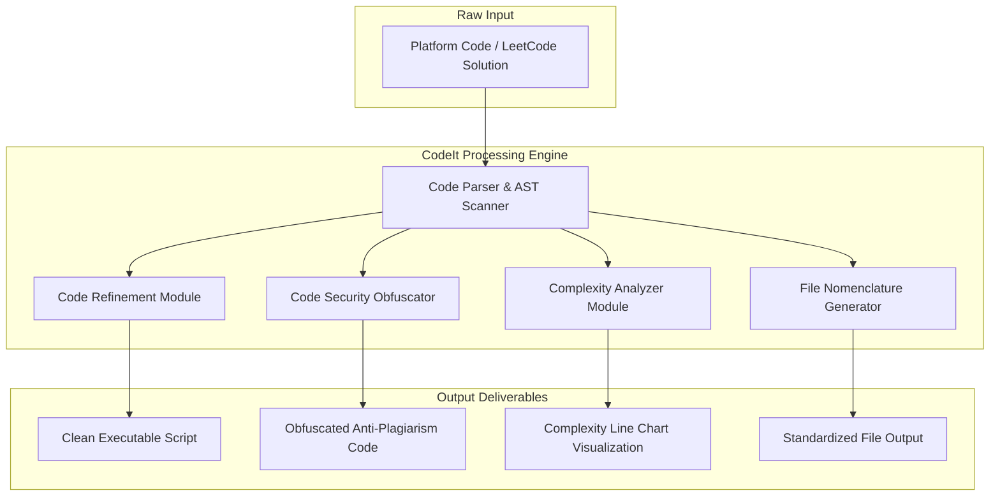

# CodeIt | <a href="https://codeittool.netlify.app">Tool</a>
#### Developing for the Developers


<!---->


  
  
  
  
  
  
  
  
  
  
  
  
  <a href="https://codeittool.netlify.app/"></a>


## Featured In

<table>
<tr>
      <th>Event Logo</th>
      <th>Event Name</th>
    </tr>
    <tr>
        <td></td>
        <td><a href="https://gssoc.girlscript.tech/">GirlScript Summer of Code Ext (GSSoC'24) </a>2024</td>
    </tr>
   <tr>
        <td></td>
        <td><a href="https://hacktoberfest.com/">Hacktober Fest</a> 2024</td>
    </tr>
</table>

### Table of Contents

| [About CodeIt](#about) | [Key Features](#key-features) | [Preview](#preview) | [Benefits](#benefits) | [Repository Structure](#repository-structure) | [Contribute](#contribute) | [Use CodeIt](#use-codeit) |
|:--:|:--:|:--:|:--:|:--:|:--:|:--:|

## About
CodeIt is a software solution tool designed to streamline and enhance the coding experience for developers. It addresses several common challenges faced when working with coding platforms, such as LeetCode, and offers a range of features to improve code management, security, and performance analysis.

## Key Features

- Code Conversion and Integration:
> Quickly convert the default / boilerplate code provided by `coding platforms like Leetcode` to a more useful and executable code in one click! 
> 
> It reduces repetitive tasks, manual mistakes and saves time. 

- Code Obfuscation:
> Make your code harder to read and understand but still executable. It adds an `extra layer of security`, protecting your code from plagiarism.
> 
> This feature is of great importance when you're working on innovative projects.

- File Naming with Extensions:
> Follow a fixed `file naming convention`, which helps reducing the overhead of manual file management.
> 
> It is useful for the developers working on large and collaborative projects.

```python
directoryName/questionNumber-question-title.extention
```

- Time Complexity Analyzer:
> Understand how fast your code runs and optimize it for better performance. CodeIt also visualises the time complexity on a line-chart for better understanding.

- User-Friendly Interface
> With a clean and straightforward UI, CodeIt ensures even beginners can navigate and utilize the tool effectively.

- Multi-Language Support
> Whether you’re coding in Python, Java, C++, or any other popular programming language, CodeIt has got you covered.
  
  Supported Features:
  | Language | Code Refinement | Code Obfuscation | Time Complexity Analyzer | Nomenclature |
  |-|-|-|-|-|
  | Python |✔|✔|✔|✔|
  | C++ |✔|✘|✔|✔|
  | Java |✔|✘|✔|✔|
  | JavaScript |✔|✔|✘|✔|
  | C |✔|✘|✔|✔|
  | SQL |-|✔|-|✔|

>[!NOTE]
> As of now, This tool generates code according to [LeetCode](https://leetcode.com/) only. I'll be adding more coding platforms to it soon.

## System Architecture


```mermaid
flowchart TD
    subgraph Raw Input
        Boilerplate[Platform Code / LeetCode Solution]
    end

    subgraph CodeIt Processing Engine
        Parser[Code Parser & AST Scanner]
        Refiner[Code Refinement Module]
        Obfuscator[Code Security Obfuscator]
        Complexity[Complexity Analyzer Module]
        Nomenclature[File Nomenclature Generator]
    end

    subgraph Output Deliverables
        Executable[Clean Executable Script]
        Secured[Obfuscated Anti-Plagiarism Code]
        Chart[Complexity Line Chart Visualization]
        NamedFile[Standardized File Output]
    end

    Boilerplate --> Parser
    Parser --> Refiner
    Parser --> Obfuscator
    Parser --> Complexity
    Parser --> Nomenclature

    Refiner --> Executable
    Obfuscator --> Secured
    Complexity --> Chart
    Nomenclature --> NamedFile
```

## Installation & Local Setup

### Live Web App
CodeIt is accessible online without any installation at [codeittool.netlify.app](https://codeittool.netlify.app/).

### Running Locally
1. **Clone the Repository:**
   ```bash
   git clone https://github.com/tjiuce/CodeIt.git
   cd CodeIt
   ```
2. **Serve the Application:**
   Open `index.html` directly in any web browser, or start a local HTTP server:
   ```bash
   npx live-server .
   # OR
   python -m http.server 8000
   ```
3. **Python Complexity Backend (Optional):**
   ```bash
   python resources/algo.py
   ```

## Preview

#### Code Refiner

<details> 
 <summary align=left><H4>View More</H4></summary><br>
  
#### Time Complexity Analyser

#### Code Obfuscator

</details>

## Benefits

  - Save Time: Eliminate the repetitive task of manually converting code templates, freeing up more time to focus on solving the problem at hand.
  - Increase Accuracy: Reduce the risk of errors that can occur during manual code adjustments.
  - Enhance Productivity: Speed up your coding process with streamlined workflows and intuitive tools.

## Repository Structure

📂 [Repository Structure](/Documentation/PROJECT_STRUCTURE.md)

### Star History

<picture>
  <source
    media="(prefers-color-scheme: dark)"
    srcset="
      https://api.star-history.com/svg?repos=tjiuce/CodeIt&type=Date&theme=dark
    "
  />
  
  <source
    media="(prefers-color-scheme: light)"
    srcset="
      https://api.star-history.com/svg?repos=tjiuce/CodeIt&type=Date
    "
  />
  
</picture>

## Contribute
**💬 Got ideas?**

- Get involved! We’d love to hear your ideas. Drop your feature suggestions in the [Discussions](https://github.com/tjiuce/CodeIt/discussions).
- You can also use [Discussions](https://github.com/tjiuce/CodeIt/discussions) to look for answers to your doubts regarding any feature of this project.

**💻 Want to solve issues?**

- Star the Repository ⭐
- Go to [issues](https://github.com/tjiuce/CodeIt/issues), find an issue that you can solve or create a new issue.
- Fork the repository.
- Create a new branch (`git checkout -b feature-branch`).
- Go to [`line no. 1` in homeScript.js](https://github.com/tjiuce/CodeIt/blob/main/resources/homeScript.js#L1-L2) and append the name of your city to the `cities` array. (optional)
- Make your contributions and commit them (`git commit -m 'Add feature'`).
- Push to the branch (`git push origin feature-branch`).
- Create a Pull Request, so I can review and merge it.


### Our Valuable Contributors ❤️✨

[](https://github.com/tjiuce/CodeIt/graphs/contributors)

### Stargazers ❤️

<div align='left'>

[](https://github.com/tjiuce/CodeIt/stargazers)

</div>

### Forkers ❤️

[](https://github.com/tjiuce/CodeIt/network/members)


### Use CodeIt
|<a href="https://codeittool.netlify.app/"></a>|[Visit CodeIt's Website](https://codeittool.netlify.app/)|
|-|-|

<div align="center">
    <a href="#top">
        
    </a>
</div>

```

```


